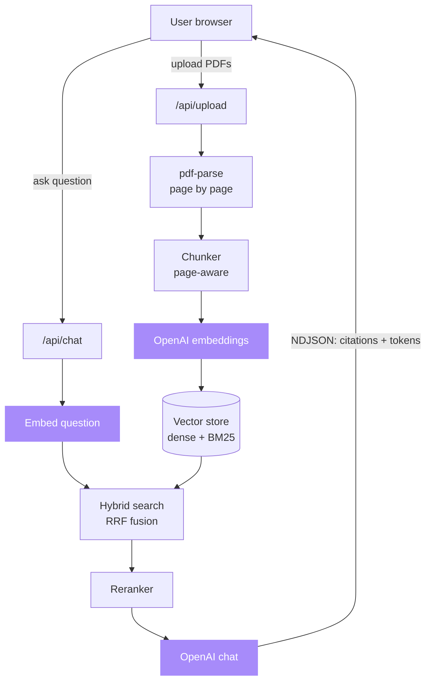

# RAG-over-PDF

[](LICENSE)
[](https://github.com/sarmakska/rag-over-pdf)
[](https://github.com/sarmakska/rag-over-pdf/commits/main)
[](https://nextjs.org)
[](https://typescriptlang.org)
[](https://vercel.com)

**Chat with your PDFs: hybrid retrieval, reranking, and streaming answers with page-level citations.**

Upload one or many PDFs and ask questions across them. The app extracts text page by page, runs hybrid search (dense embeddings plus BM25) over the chunks, reranks the candidates for precision, and streams a grounded answer with citations that point back to the exact source and page. It is a readable, framework-free RAG implementation you can clone, run, and ship.

Built by [Sarma Linux](https://sarmalinux.com). Built to ship, not to sit on a shelf.

---

## What this is

A working Retrieval-Augmented Generation starter that takes RAG past the toy stage. It does what the serious implementations do (hybrid search, a reranking stage, real citations) without burying any of it under a framework. Every moving part is a short, readable TypeScript module you can open and understand.

The whole retrieval pipeline is a few hundred lines. No vector DB to provision, no Pinecone account, no LangChain weight. You can read it end to end in one sitting.

## What it solves

- "I have hundreds of internal PDFs nobody reads, can we make them searchable and citable?"
- "We need a chatbot grounded in our actual documentation, with sources, not the open web"
- "Dense-only retrieval keeps missing exact product codes and error strings"
- "I want to learn how production-grade RAG actually works under the hood, without a framework hiding it"

## Architecture



Single-process, single-machine. The vector store is one file behind a small interface, so swapping the in-memory index for `pgvector`, Supabase Vector, Pinecone, or Qdrant is a contained change.

## Quick start

```bash
git clone https://github.com/sarmakska/rag-over-pdf.git
cd rag-over-pdf
pnpm install
cp .env.example .env.local   # then add your OPENAI_API_KEY
pnpm dev
```

Open [http://localhost:3000](http://localhost:3000), upload one or more PDFs, tick which documents to search, and ask a question. Answers stream in with a numbered source list that links each claim to a document and page.

## Features

- **Hybrid search.** Dense embeddings plus a BM25 lexical index, fused with Reciprocal Rank Fusion. Dense handles meaning and paraphrase, BM25 handles exact terms such as error codes and identifiers. Fusion is more robust than either alone.
- **Reranker step.** Hybrid search casts a wide net for recall, then a reranker reorders the candidates for precision. The default LLM reranker scores each candidate against the question; if it fails it falls back to a deterministic lexical reranker.
- **Citation streaming.** The chat response is a newline-delimited JSON stream. Citations arrive first so the UI shows sources immediately, then answer tokens stream, then a done event closes it.
- **Multi-document chat.** Index many PDFs at once. Ask across all of them, or scope a question to a subset.
- **Page-level highlights.** Text is extracted page by page, every chunk knows its page, and each citation carries the source filename, page number, and a snippet.

## What is in the box

- **`app/api/upload`** parses a PDF page by page, chunks the text with page tracking, embeds each chunk, and adds it to the store as its own document. Also lists and deletes documents.
- **`app/api/chat`** embeds the question, runs hybrid retrieval, reranks, and streams citations then answer tokens as NDJSON. Accepts a `docIds` array to scope the question.
- **`lib/pdf.ts`** page-aware PDF text extraction via the pdf-parse pagerender hook.
- **`lib/chunker.ts`** fixed-size character chunker with overlap and page tracking.
- **`lib/bm25.ts`** a compact, dependency-free BM25 sparse index.
- **`lib/vector-store.ts`** in-memory cosine store plus BM25, hybrid search with RRF, and multi-document support. This is the one file you replace to move to a real database.
- **`lib/reranker.ts`** the LLM reranker and its deterministic lexical fallback.
- **`lib/retrieval.ts`** the orchestrator that wires hybrid search to the reranker.
- **`lib/citations.ts`** the NDJSON streaming protocol shared by server and client.
- **`lib/openai.ts`** a lazily constructed OpenAI client plus the embedding helper, so `next build` runs without an API key.
- **`app/page.tsx`** the upload, document list, chat, and citation UI built with Tailwind.
- **`tests/`** unit and end-to-end tests with committed fixture PDFs. No network, no key required.

## When to use this / when not to

Use this when you want to learn how production-grade retrieval-augmented generation actually works without a framework hiding the moving parts, when you are prototyping a documentation chatbot grounded in your own PDFs and need real citations, or when you need a clean starting point you can extend into a production system.

Do not use this as-is for a high-traffic production deployment. The in-memory store clears on restart and holds its documents in a single process, and chunking is fixed-size rather than structure-aware. Swap the vector store for pgvector or a managed index and harden the upload path before you put real load on it.

## Documentation

Full architecture notes, a retrieval deep-dive, tuning guides, a pgvector migration path, and deployment recipes live in the [project wiki](https://github.com/sarmakska/rag-over-pdf/wiki).

## Tech stack

| Layer | Choice | Why |
|---|---|---|
| Framework | Next.js 14 App Router | Streaming, server routes, edge-ready |
| Language | TypeScript | Catch errors before runtime |
| PDF parsing | `pdf-parse` | Pure JS, no native deps, page-by-page extraction |
| Embeddings | OpenAI `text-embedding-3-small` | Cheap, 1536 dims, fast |
| Sparse retrieval | BM25 (in-repo) | Exact-term recall, no dependency |
| Fusion | Reciprocal Rank Fusion | No score normalisation needed |
| Reranking | LLM cross-encoder, lexical fallback | Precision on the recall pool |
| Generation | OpenAI `gpt-4o-mini` (streaming) | Cheap, fast, follows instructions |
| Styling | Tailwind CSS | Get on with it |

## Configuration

| Env var | Required | Default | Purpose |
|---|---|---|---|
| `OPENAI_API_KEY` | yes | none | Used for embeddings, reranking, and generation |
| `EMBEDDING_MODEL` | no | `text-embedding-3-small` | Override the embedding model |
| `CHAT_MODEL` | no | `gpt-4o-mini` | Override the generation and reranking model |
| `CHUNK_SIZE` | no | `1000` | Characters per chunk |
| `CHUNK_OVERLAP` | no | `200` | Overlap between chunks |
| `TOP_K` | no | `5` | Chunks kept after reranking |

## Swap to pgvector (when you need persistence)

The in-memory store lives in `lib/vector-store.ts`. Replace its methods with Postgres calls and you are on a real DB. The retrieval pipeline depends only on the interface.

```sql
create extension if not exists vector;
create table chunks (
  id text primary key,
  doc_id text not null,
  source text,
  page int,
  content text not null,
  embedding vector(1536) not null,
  created_at timestamptz default now()
);
create index on chunks using hnsw (embedding vector_cosine_ops);
create index on chunks (doc_id);
```

See [Swap-to-pgvector](https://github.com/sarmakska/rag-over-pdf/wiki/Swap-to-pgvector) for the full migration, including how to keep BM25 in Postgres with `tsvector`.

## Deploy to Vercel

[](https://vercel.com/new/clone?repository-url=https://github.com/sarmakska/rag-over-pdf)

Vercel prompts for `OPENAI_API_KEY`. That is the only configuration needed.

## Limitations (honest list)

- **In-memory store.** Restarting the server clears the index. Fine for demos, swap to pgvector for anything real.
- **BM25 reindex on every upload.** The in-memory BM25 index rebuilds its corpus when documents change. Trivial at starter scale, move term statistics into Postgres at large scale.
- **Fixed-size chunking.** Production RAG benefits from semantic or structure-aware chunking. Out of scope for a starter.
- **Cost.** Each question is an embedding call, a reranking call, and a generation call. With the small models that is well under a penny per question, but it is not free. Set the reranker aside if you want to drop one call.

## Roadmap

- [x] PDF upload and page-by-page parsing
- [x] In-memory vector store
- [x] Streaming answers
- [x] Hybrid search (BM25 + embeddings)
- [x] Reranker step
- [x] Citation streaming
- [x] Multi-document chat
- [x] Page-level highlights
- [ ] pgvector adapter as a drop-in
- [ ] Local embedding option (sentence-transformers via Ollama)
- [ ] Semantic chunking

PRs welcome.

## Related work

- [SarmaLink-AI](https://github.com/sarmakska/Sarmalink-ai) multi-provider AI backend with automatic failover
- [StaffPortal](https://github.com/sarmakska/staff-portal) open-source staff management platform

## License

MIT. Use it however you want. Attribution appreciated, not required.

Built by [Sarma Linux](https://sarmalinux.com).

---

## More open source by Sarma

Part of a portfolio of twelve production-shaped open-source repositories built and maintained by [Sarma](https://sarmalinux.com).

| Repository | What it is |
|---|---|
| [Sarmalink-ai](https://github.com/sarmakska/Sarmalink-ai) | Multi-provider OpenAI-compatible AI gateway with 14-engine failover and intent-based plugin auto-routing |
| [agent-orchestrator](https://github.com/sarmakska/agent-orchestrator) | Durable multi-agent workflows in TypeScript with deterministic replay and Inspector UI |
| [voice-agent-starter](https://github.com/sarmakska/voice-agent-starter) | Sub-second full-duplex voice agent loop. WebRTC, mediasoup, pluggable STT / LLM / TTS |
| [ai-eval-runner](https://github.com/sarmakska/ai-eval-runner) | Evals as code. Python, DuckDB, FastAPI viewer, regression mode for CI |
| [mcp-server-toolkit](https://github.com/sarmakska/mcp-server-toolkit) | Production Model Context Protocol server starter (Python / FastAPI) |
| [local-llm-router](https://github.com/sarmakska/local-llm-router) | OpenAI-compatible proxy that routes to Ollama or cloud providers based on policy |
| [rag-over-pdf](https://github.com/sarmakska/rag-over-pdf) | Hybrid-search RAG starter for PDF corpora with reranking and citations |
| [receipt-scanner](https://github.com/sarmakska/receipt-scanner) | Vision OCR for receipts with Zod-validated JSON output |
| [webhook-to-email](https://github.com/sarmakska/webhook-to-email) | Webhook receiver that forwards events to email via Resend |
| [k8s-ops-toolkit](https://github.com/sarmakska/k8s-ops-toolkit) | Helm chart for shipping Next.js to Kubernetes with full observability stack |
| [terraform-stack](https://github.com/sarmakska/terraform-stack) | Vercel + Supabase + Cloudflare + DigitalOcean modules in one Terraform repo |
| [staff-portal](https://github.com/sarmakska/staff-portal) | Open-source HR / ops portal: leave, attendance, expenses, kiosk mode |

Engineering essays at [sarmalinux.com/blog](https://sarmalinux.com/blog) and all projects at [sarmalinux.com/open-source](https://sarmalinux.com/open-source)
